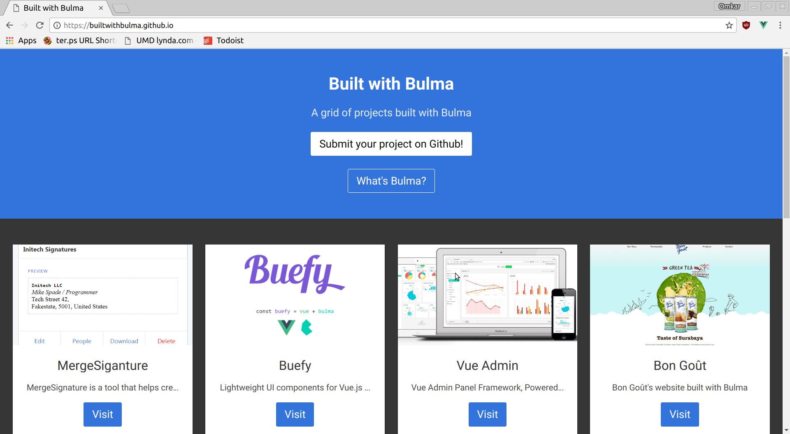

# builtwithbulma
http://builtwithbulma.github.io



A website containing projects built with [Bulma](http://bulma.io), a CSS framework.

**Goal:** Build a website similar to [http://builtwithbootstrap.com](http://builtwithbootstrap.com) but ad-free and for Bulma instead of Bootstrap. 

**Purpose:** Let there be one place where people can browse projects built with Bulma to see how others have used Bulma and to obtain inspiration for their own projects.

## How do I add my project?

1. Fork the repository
2. Add your project to index.html by listing it under the rest
```html
<bulma-project 
title="Title of your project" 
link="https://www.example.com" 
picture="https://www.example.com/link-to-picture">
Short description of your project
</bulma-project>
```
3. Make a pull request